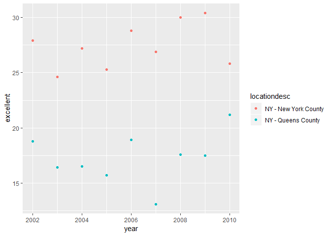

Homework 2
================
Jyoti Ankam
September 28, 2018

Loading the package - tidyverse:

``` r
library(tidyverse)
```

    ## -- Attaching packages ----------------------------------------------------- tidyverse 1.2.1 --

    ## v ggplot2 3.0.0     v purrr   0.2.4
    ## v tibble  1.4.2     v dplyr   0.7.4
    ## v tidyr   0.8.0     v stringr 1.3.1
    ## v readr   1.1.1     v forcats 0.3.0

    ## -- Conflicts -------------------------------------------------------- tidyverse_conflicts() --
    ## x dplyr::filter() masks stats::filter()
    ## x dplyr::lag()    masks stats::lag()

Reading the csv dataset NYC transit:

Problem 1:

``` r
nyc_transit = read_csv(file = "./data/NYC_Transit_Subway_Entrance_And_Exit_Data.csv") %>% 
  janitor::clean_names() %>% 
  select(line:entry, vending, ada) %>% 
  mutate(entry = recode(entry, "YES" = TRUE, "NO" = FALSE))
```

    ## Parsed with column specification:
    ## cols(
    ##   .default = col_character(),
    ##   `Station Latitude` = col_double(),
    ##   `Station Longitude` = col_double(),
    ##   Route8 = col_integer(),
    ##   Route9 = col_integer(),
    ##   Route10 = col_integer(),
    ##   Route11 = col_integer(),
    ##   ADA = col_logical(),
    ##   `Free Crossover` = col_logical(),
    ##   `Entrance Latitude` = col_double(),
    ##   `Entrance Longitude` = col_double()
    ## )

    ## See spec(...) for full column specifications.

The NYC transit dataset contains information about NYC Transit trains, stations and routes. Some of the relevant variables included - stations, trains, routes served, vending information and ada compliance information. First we imported the data and clean the variables names by replacing spaces with underscores and making them lower case. Then, we selected the variables that were needed for analysis. We also changed the variable 'entry' to the logical type.

We have 1868 rows times 19 columns. The data wasn't tidy at first as some of the data under routes was spread across multiple columns. In addition, data under route numbers was under the route variable (column).

``` r
ada_compliant = distinct(nyc_transit, line, station_name, ada)

sum(ada_compliant$ada)
```

    ## [1] 84

``` r
nrow(ada_compliant)
```

    ## [1] 465

From the code chunk above and also from this inline code, we know that there are 465 stations. From these 465 stations, total 84 are ada compliant.

``` r
ent_vend_df = mutate(nyc_transit, vending = recode(vending, "YES" = TRUE, "NO" = FALSE),
                  entry_vend = !(entry == vending))

prop_vending = sum(ent_vend_df$entry_vend)/nrow(ent_vend_df)
```

In this code chunk above, we are identifying the stations with no vending but allow entrance. By using a logical variable, it seems easier to find the sum of logical variables to find the number of TRUEs, such that the logical condition is negated and the FALSES are converted to TRUEs.

We have 0.0374732 of entrance/exits with no vending that allow entrance.

Reformatting the data to find the total number of stations serving the A train service:

``` r
reformat_df = gather(ent_vend_df, key = route_num, value = train, route1:route11) %>% 
  separate(route_num, into = c("delete", "route"), sep = 5) %>% 
  select(-delete) %>% 
  distinct(line, station_name, train, ada) %>% 
  filter(train == "A")
```

There are 60 distinct stations that serve the A train. From the distinct stations that serve the A train, 17 are ADA compliant.

Problem 2:

``` r
trash_wheel_df = readxl::read_excel("./data/HealthyHarborWaterWheelTotals2017-9-26.xlsx", sheet = "Mr. Trash Wheel", range = "A2:N258") %>% 
  janitor::clean_names() %>% 
  filter(!is.na(dumpster), dumpster != 23220) %>% 
  mutate(sports_balls = as.integer(sports_balls))
```

Reading and cleaning precipitation data 2016 and 2017:

``` r
precip_2016 = readxl::read_excel("./data/HealthyHarborWaterWheelTotals2017-9-26.xlsx", sheet = "2016 Precipitation", range = "A2:B14") %>% 
  janitor::clean_names() %>% 
  mutate(year = 2016) 


precip_2017 = readxl::read_excel("./data/HealthyHarborWaterWheelTotals2017-9-26.xlsx", sheet = "2017 Precipitation", range = "A2:B14") %>% 
  janitor::clean_names() %>% 
  mutate(year = 2017) %>% 
  filter(!is.na(total))
```

Combining the datasets for 2016 and 2017:

``` r
precip_16_17_df = bind_rows(precip_2016, precip_2017)

month_vec = month.name[c(pull(precip_16_17_df, month))]

month_name_df = tibble::as.tibble(month_vec)

precip_total = bind_cols(precip_16_17_df, month_name_df) %>% 
  select(-month) %>% 
  select(year, month = value, total)
```

The median number of sportsballs in a dumpster in 2016:

``` r
median_balls_16 = trash_wheel_df %>% 
  filter(year == 2016)
```

The trash wheel dataset contains 215 rows times 14 columns after tidying/cleaning. It contains a wide range of information about the trashwheel waste collector. There's information about the different types of waste collected like number of sport balls, grocery bags, cigarette butts, chip bags, plastic and glass bottles etc. Information on date is also collected.

The precipitation datasets contain information about precipation for the years 2016 and 2017. There are 12 rows times 3 columns in the 2016 precipation dataset. In the 2017 dataset, there are 8 rows times 3 columns. Both datasets combined contain information on total precipation in each month.

The total precipitation in 2017 is 29.93 and the median number of sports balls is 26.

Problem 3: Installing the package

``` r
# install.packages("devtools")
devtools::install_github("p8105/p8105.datasets")
```

    ## Skipping install of 'p8105.datasets' from a github remote, the SHA1 (21f5ad1c) has not changed since last install.
    ##   Use `force = TRUE` to force installation

``` r
library(p8105.datasets)

data(brfss_smart2010)
```

Tidying and fomratting the data:

``` r
brfss_smart_df = brfss_smart2010 %>% 
  janitor::clean_names() %>% 
  filter(topic == "Overall Health") %>% 
  select(-(class:question), -sample_size, -(confidence_limit_low:geo_location)) %>% 
  spread(key = response, value = data_value) %>% 
  janitor::clean_names() %>% 
  mutate(excellent_verygood = excellent + very_good)
```

Using this dataset, do or answer the following:

There are 51 distinct locations. Yes, all states are represented.

``` r
observed_most = count(brfss_smart_df, locationabbr) %>% 
  top_n(1, n)
```

NJ is the most observed state with 146 municipalities/counties.

``` r
data_2002_df = brfss_smart_df %>% 
  filter(year == 2002)

median(data_2002_df$excellent, na.rm = TRUE)
```

    ## [1] 23.6

23.6 is the median of the Excellent response in 2002.

Histogram of Excellent responses in the year 2002:

``` r
ggplot(data_2002_df, aes(x = excellent)) + 
  geom_histogram()
```

    ## `stat_bin()` using `bins = 30`. Pick better value with `binwidth`.

    ## Warning: Removed 2 rows containing non-finite values (stat_bin).


Scatterplot showing the proportion of “Excellent” response values in New York County and Queens County (both in NY State) in each year from 2002 to 2010:

``` r
brfss_smart_df %>% 
  filter(locationdesc %in% c("NY - New York County", "NY - Queens County")) %>% 
  ggplot(aes(x = year, y = excellent, color = locationdesc)) +
  geom_point()
```


